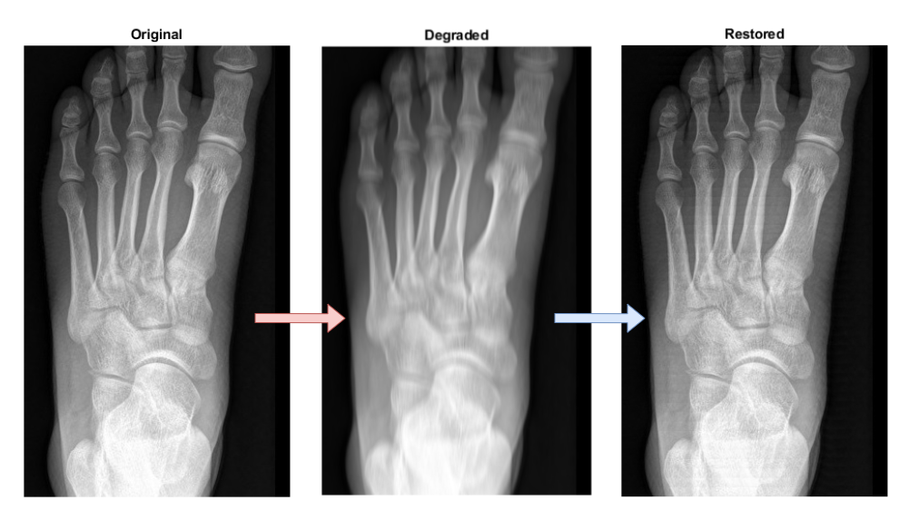

### *This xray image has some artifacts. Can we improve the image quality?*

# Scope
This project contains the files for the academic project for the course *Computational Linear Algebra for Large Scale problems* focused on **Moore-Penrose pseudo inverse matrix**.  

The topic of the project is very personal: I was gifted for my birthday of a pass to go in a trampuline park. After 7 minutes of warm-up, I put the foot in a wrong position without even jumping and I felt a strong pain: end of the fun. The next day, I was diagnosed with a small cuboid fracture, i.e. a small bone of the foot.  
Medical images such as X-ray are prone to artifact effects that alter the visibility of the anatomical structure: the goal of this sample project is to simulate the image reconstruction, using mathematical techniques applied to matrices such as Moore-Penrose pseudo inverse matrix.

Mathematical topics involved: *Moore-Penrose pseudo inverse matrix*.

The [pseudoinv_for_img_reconstruction](pseudoinv_for_img_reconstruction.pdf) pdf contains a detailed report with mathematical explanation and implementation details. 

# Language
The code is developed entirely in Matlab 2023.

# Dataset
An X-ray image available on the web was used. The image does not present quality issues, that are then deterministically added via code. 

# Instruction
Open and run *xrays_enhance.m* in Matlab.

# Author
Corrado Navilli
